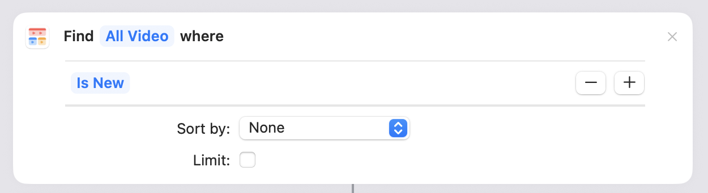
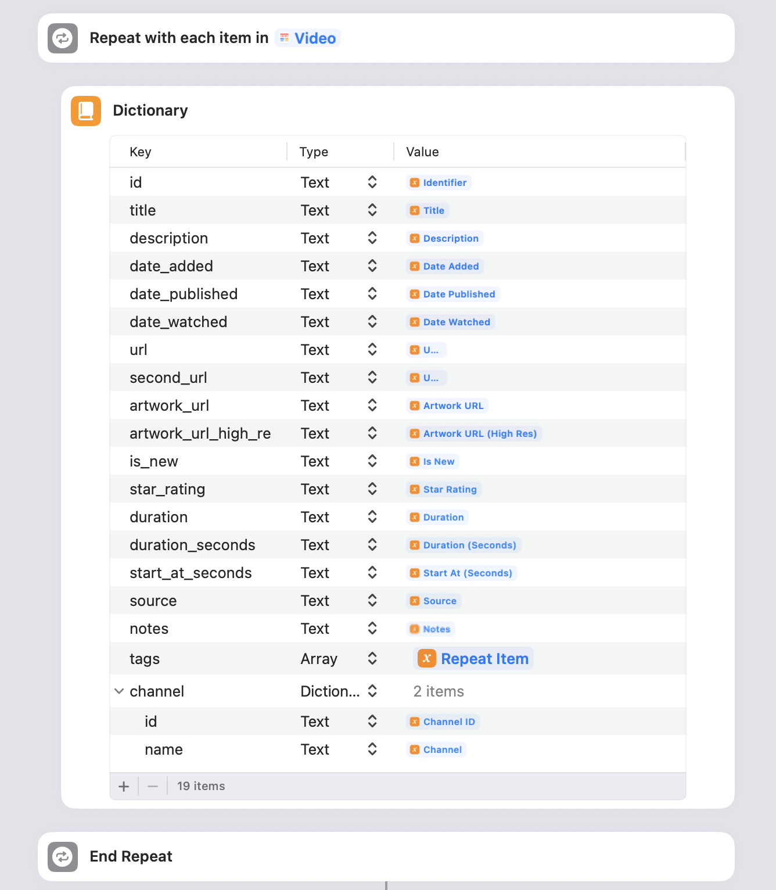
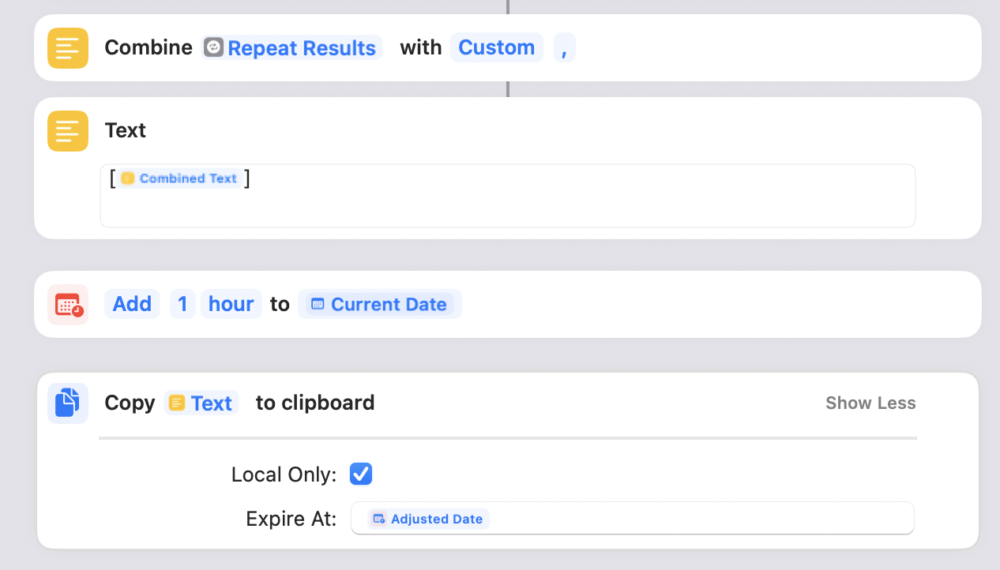

# Shortcut For Getting Play Videos

Shortcut: https://www.icloud.com/shortcuts/69fea3ad88844fd5a6b8b83039a2e3c2

You may use the above shortcut to extract Play videos to a format that can be processed by the extension.

## Things To Note

You may adjust the conditions for what videos are retrieved.

The shortcut is configured to get all videos by default. If it takes too long to complete or crashes, try adjusting it to get "new" videos only or some other filter of your choosing.

For more information, read the comments left in the shortcut.

## Do I Need This Shortcut?

For saving videos to Play, no.

But if you want to see information like what videos are already saved in Play, the extension needs to get that data and store it in your browser to compare and contrast.

## The Link Is Broken

If you have trouble accessing the link, make sure that an issue isn't [already open](https://github.com/danielh-official/SaveToPlay/issues?q=is%3Aissue%20state%3A%20open%20shortcut%20link%20doesn%27t%20work) for this problem and open the ticket: https://github.com/danielh-official/SaveToPlay/issues/new

If the link remains broken and you need access ASAP, follow these steps to create the shortcut.

1. Open Shortcuts on Mac or iOS
2. Insert Play's "Find Video" shortcut, set it up to filter to your ideal specifications or leave blank to get all videos
3. Insert a "Repeat with Each" shortcut and insert the variable for your filtered videos
4. Within the repeat loop, insert the "Dictionary" and build it out with the following specifications, in order of key, type, and value (is a value of the Repeat Item):

| Key                  | Type       | Value                  |
| -------------------- | ---------- | ---------------------- |
| id                   | Text       | Identifier             |
| title                | Text       | Title                  |
| description          | Text       | Description            |
| date_added           | Text       | Date Added             |
| date_published       | Text       | Date Published         |
| date_watched         | Text       | Date Watched           |
| url                  | Text       | Url                    |
| second_url           | Text       | Url                    |
| artwork_url          | Text       | Artwork URL            |
| artwork_url_high_res | Text       | Artwork URL (High Res) |
| is_new               | Text       | Is New                 |
| star_rating          | Text       | Star Rating            |
| duration             | Text       | Duration               |
| duration_seconds     | Text       | Duration (Seconds)     |
| start_at_seconds     | Text       | Start At (Seconds)     |
| source               | Text       | Source                 |
| notes                | Text       | Notes                  |
| tags                 | Array      | Tags                   |
| channel              | Dictionary | 2 items                |

"channel" is a nested dictionary with the following key, value pairs:

| Key  | Type | Value      |
| ---- | ---- | ---------- |
| id   | Text | Channel ID |
| name | Text | Channel    |

5. Insert "Combine Text" and Combine the "Repeat Results" with a Custom ","
6. Insert "Text" and place the "Combined Text" inside while wrapping it in brackets ([...]).
7. Insert "Copy to Clipboard" and use the "Text" variable

- Optional: Before copying to clipboard, insert "Adjust Date" and set it to whatever time past the "Current Date" (e.g., 1 hour). In the "Copy to Clipboard"'s Expire At field, add the "Adjusted Date" so that your copied videos clear after the designated time has past.

See screenshots for further details.

## Screenshots

